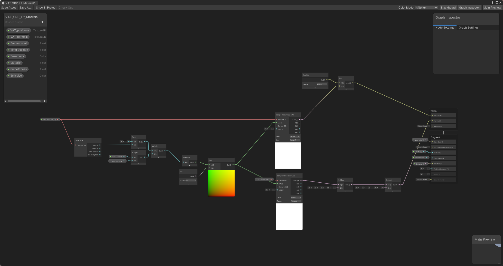

Alembic to VAT (Vertex Animation Texture) converter for Unity (Legacy, URP & HDRP)
==================================================================================

This is a repository that contains a simple tool to convert Alembic files
to Vertex Animation textures.

It's working for the simple cases I've tested, you may find cases with
issues ... I'm aware of that, but that project is provided AS IS, I will 
not provide any support for this, you have the code, you have some samples
and it's provided for free.

System requirements
-------------------

- Unity 2022.3
- Alembic package
- Editor coroutine package

How to use Alembic to VAT converter
-------------------------------------
 
Be sure to have the Alembic and Editor coroutine package installed in your project

- Drop an alembic file in your scene
- Open the converter window (Window > Alembic to VAT)
- Drop the Alembic player in 'Alembic player'.
- This will animated the Alembic file once and update the Animation info in the converter window. This will tell you if you have a Variable topology animation (different meshes every frames) or a Fixed topology animation (same mesh morphed between frames)
- Select the directory where you will export it (Export path) in the list of Resources directories you have in your project. You need at least one 'Resources' directory
- The filename for the export is by default the name of the object you have dropped (Export filename)
- Check that the final path is what you want (Final path - read only).
- Once you're happy with all of these, you can bake the animation with the 'Bake mesh' button. Depending on the complexity of your Alembic file, this may take some time.

What does it generates?
-------------------------
Once done, all your resources are created and imported in your project automatically. You can drop the xxx_prefab object created and drop it in your scene. To animate the VAT, just change the Time position in the material. 

The tool have generated 2 textures : 
- xxx_position that contains the positions of the vertices relative to the first frame of the animation.
- xxx_normal that contains the animated normals in model space if you don't have an unlit mesh.
You will also have a base mesh, a material and a ready to use prefab

The shader material
--------------------
It's either an amplify shader if you use the legacy pipeline, or a shader graph if you use URP or HDRP
 
 

Creating you own compatible shader
----------------------------------
The provided shaders have been made with Amplify shader editor and shader graph and you can easily modify them to match your needs.

The RGB of the VAT_normals texture are in XYZ of the local vertex normal - it needs to be multiply by 2 subtract 1 like you do on a normal map as it can be stored in an RGBA32 texture
The texture coordinates to access those 2 textures are in the SECOND UV SET, not the first one. So you can keep the texturing on your object
To this UV2 you have to add to the X component the offset to go to the wanted frame. So it will be something like frameNumber*1/Texture width.

What are the extra options?
---------------------------
Store position in UV3 : This will store the pivot of the object in UV3, that way you can apply some common changes to whole sub-objects easily

Exported from Blender : Meshes exported from Blender requires an extra transformation before being baked. You can try this option if you don't have the expected result

Unlit Mesh : This will not export the normal map and will select an unlit material (in URP & HDRP). 

Compress normal : This will store the normal in an R8G8B8A8 texture instead of a RGBA_Half which is using twice the amount of VRAM but have better accuracy

Alembic samples provided in the project
---------------------------------------
You can use freely the provided Alembic files, it's just simple tests, feel free to do whatever you want with them

When will this be updated?
--------------------------
I may or may not update that project again, I have no plans for the moment ... it was just a 2-3 days quick project made to help my students use more efficiently their Alembic files, on any platform, for a very cheap cost.

Can you help me with, it's not working for me?
----------------------------------------------
Sorry, but no. The project is provided as is and I don't provide any support for it whatsoever. 

Can I use this tool freely?
---------------------------
Feel free to use the tool in your projects, improve it, modify it ... 
Just don't sell it and make profit out of it please, it is free on purpose. 
